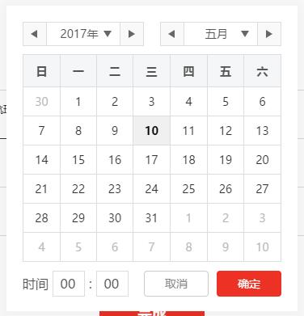

# React 日期时间选择器组件

这是一个React简陋的日期与时间的选择器，谁让我没能找到刚刚有日期和时间的选择器呢，可能某些设定上比较坑……比如，已经懒到不想把秒加进去了




你可能需要使用这个组件的两个重要文件  
组件入口 
```javascript
import DatePicker from "./datepicker"   
```
核心JS（伪）
```javascript
import DatePickerCore from "./datepicker/core" 
const datepicker = new DatePickerCore()
```

我还假装这个组件支持多语言的设定，就在core.js里面
  
组件的快捷使用方法
```javascript
// min 最小值
// max 最大值
// start 开始时间
// isTime 是否用时间选择
// confirm 用户点击确认的执行 返回 date 年月日数组 time 时分数组 millisecond 毫秒
// cancel 用户点击取消 告诉你应该把这个组件关了
<DatePicker min={min} max={max} start={start} isTime={isTime} confirm={this.dateChange.bind(this)} cancel={this.closeDate.bind(this)} />
```

组件用了scss，所以你在打包编译的时候，需要把sass-loader加上